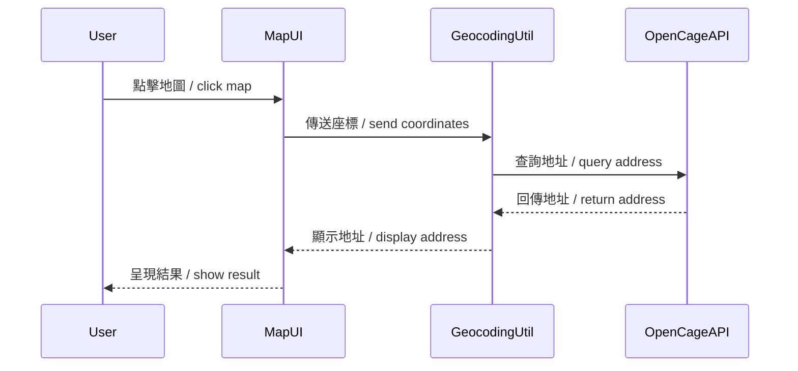

# Story-1 - 座標轉地址功能 / Coordinate to Address Feature

## 中文說明

**作為一個使用者**
我希望能將地圖上的座標轉換為實際地址，
讓我可以更直觀地理解地點資訊。

## English Description

**As a user**
I want to convert map coordinates to real addresses,
so I can intuitively understand location information.

## Status

Draft

## Context / 背景

-   本功能讓用戶在地圖上點選任一位置時，能即時取得該點的實際地址（反查地址）。
-   主要應用於熱點上報、避難所查詢等場景，提升資訊可讀性。
-   技術上**原本規劃串接 nominatim API**，但因建構與維護較繁瑣，現階段改採用 **OpenCage 免費 API** 作為輕量解決方案，便於快速開發與部署。

This feature allows users to obtain the real address of any point clicked on the map (reverse geocoding). It is mainly used in hotspot reporting and shelter lookup scenarios to improve information readability. **Originally planned to use nominatim API, but due to its complexity, we now use OpenCage's free API for lightweight usage and easier deployment.**

## Estimation / 預估

Story Points: 2

## MVP 測試內容 / MVP Test

-   請於 [bolt.new](https://bolt.new) 測試座標轉地址功能，驗證地圖點選後能正確顯示地址。

Please use [bolt.new](https://bolt.new) to test the coordinate-to-address feature and verify that clicking on the map correctly displays the address.

## Tasks / 子任務

-   [x] 設計座標轉地址 API 介面 / Design coordinate-to-address API interface
-   [x] 串接 **OpenCage** 反查地址服務 / Integrate **OpenCage** reverse geocoding service
-   [x] 前端 UI：地圖點選觸發查詢 / Frontend UI: trigger query on map click
-   [x] 顯示查詢結果於 UI / Display result in UI

## Constraints / 限制

-   必須考慮 OpenCage API 的速率限制與錯誤處理
-   UI 必須即時回饋查詢狀態
-   必須支援多語系

Must consider OpenCage API rate limits and error handling. UI must provide real-time feedback. Must support multi-language.

## Data Models / Schema

```json
{
    "lat": "number",
    "lng": "number",
    "address": "string"
}
```

## Structure / 結構

-   前端：於地圖元件（MapContainer）中實作座標點擊事件與查詢
-   後端/工具：於 utils 或 lib 新增 geocoding 查詢模組

Frontend: implement coordinate click and query in MapContainer. Backend/utils: add geocoding module in utils or lib.

## Diagrams / 圖示



## Dev Notes / 開發備註

-   可考慮快取查詢結果以減少 API 請求
-   錯誤時需顯示提示訊息
-   測試需涵蓋 API 失敗、無法解析等情境

Consider caching results to reduce API calls. Show error messages on failure. Tests should cover API failure and unresolvable cases.

## Chat Command Log / 討論紀錄

-   User: 請協助建立座標轉地址功能的 story
-   Agent: 已建立，請審閱內容
-   User: 請修正為 OpenCage 方案，並說明原因
-   Agent: 已修正，請審閱內容
